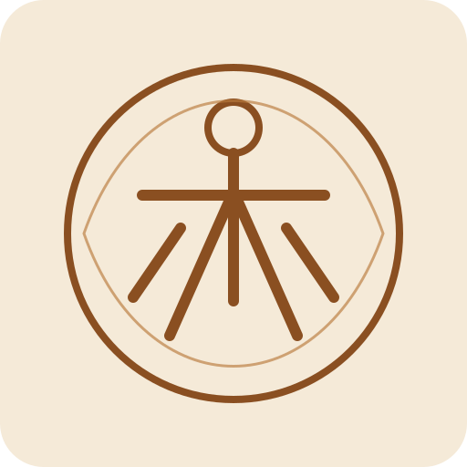
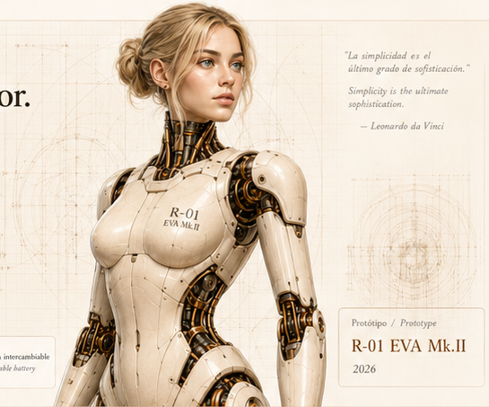
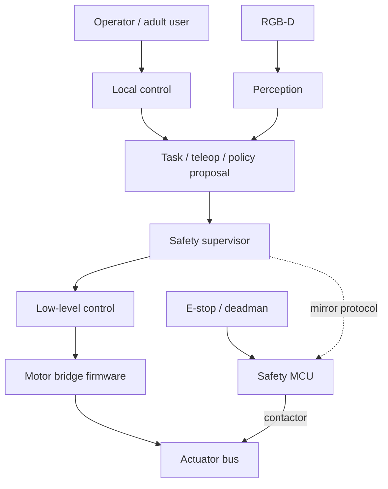
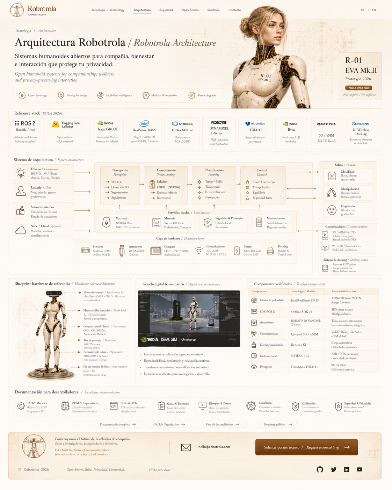

<p align="center">
  
</p>

<h1 align="center">Robotrola Core</h1>

<p align="center">
  <strong>Complete open research platform for a safety-first adult companion humanoid</strong><br/>
  42-DOF description · printable CAD · BOM · layered safety · MCU firmware · ROS 2 · LeRobot path
</p>

<p align="center">
  <a href="https://github.com/sudopimp/robotrola/actions"></a>
  <a href="LICENSE_SOFTWARE"></a>
  <a href="LICENSE_HARDWARE"></a>
  <a href="docs/CLAIMS_MATRIX.md"></a>
  <a href="SPEC.md"></a>
  
  
</p>

<p align="center">
  
</p>

> **Not a certified consumer product.** Robotrola Core is a **lab-grade open research / build package** (bench → upper body → full body).  
> Pitch only what is listed under **Proven today** in [`docs/CLAIMS_MATRIX.md`](docs/CLAIMS_MATRIX.md).

---

## Why this exists

Most “companion humanoid” decks stop at renders. Credible open humanoid work (Humanoid Lite, ToddlerBot, Reachy-class platforms) ships **description + BOM + fixtures + safety gates + data path** first.

Robotrola Core is that stack for a **non-explicit, privacy-first, adult-only** research line: AI stays above hard safety; the MCU owns power isolation.

| You get today | You do **not** get |
|---|---|
| 42-DOF full-body URDF + joint limits | CE / UL / ISO cobot certification |
| Runnable pure-Python safety path | Factory SKU or walking policy weights |
| Real ESP32 + STM32 bridge firmware sources | Load-bearing proof of every STL |
| BOM + stage cost bands (USD) | Retail “companion product” claims |
| Thin ROS 2 packages + LeRobot episode writer | Cloud brain by default |

---

## 90-second diligence demo (no robot, no ROS)

```bash
git clone https://github.com/sudopimp/robotrola.git
cd robotrola
python3 -m venv .venv && source .venv/bin/activate
pip install -e ".[dev]"
make diligence
```

Expected:

```text
pytest                 → green
validate_repo          → VALIDATION PASSED
demo_investor          → INVESTOR_DEMO_OK  dof=42
bom_cost_model         → bench / upper_body / full_body USD bands
```

Or run pieces:

```bash
pytest -q
python scripts/validate_repo.py
python scripts/bom_cost_model.py
python scripts/run_safety_path.py
python scripts/demo_investor.py
```

**Technical brief:** [`docs/INVESTOR_TECH_BRIEF.md`](docs/INVESTOR_TECH_BRIEF.md) · **Claims matrix:** [`docs/CLAIMS_MATRIX.md`](docs/CLAIMS_MATRIX.md) · **Contract:** [`SPEC.md`](SPEC.md)

---

## Architecture

```text
Teleop / local policy proposal
        │
        ▼
Feature flags  (dangerous modules OFF by default)
        │
        ▼
Safety supervisor  (mode · joint limits · interlocks)   ← pure Python, tested
        │
        ▼
Approved commands only
        │
        ▼
Motor bridge MCU  (local clamps · heartbeat · SAFETY_OK) ← C++ source
        │
        ▼
Safety MCU  (e-stop · deadman · leak · contactor · WD)   ← C++ source
        │
        ▼
Actuator power bus
```

<details>
<summary><strong>Mermaid (system view)</strong></summary>



</details>

<p align="center">
  
</p>

---

## Repository map

```text
cad/            URDF (42 DOF), STL/GLB references, print manifest (stages)
hardware/       BOM, power tree, harness, wiring
firmware/       ESP32 safety MCU + STM32 DYNAMIXEL bridge
robotrola/      Python: safety, command_path, protocol_sim, cost_model, validators
ros2_ws/src/    description · safety node · control · perception · teleop · bringup
lerobot/        episode writer + schema (approved actions only)
simulation/     Gazebo / Isaac notes
docs/           builds, safety, privacy, diligence, manufacturing
scripts/        validate · demo_investor · bom_cost · generate description
tests/          completeness + safety + protocol + claims gates
```

---

## Research build path

| Stage | Goal | Docs |
|---|---|---|
| **Bench** | Safety MCU, e-stop, tray, one actuator fixture | [`docs/builds/00_…`](docs/builds/00_bench_safety_mcu.md) · [`01_…`](docs/builds/01_one_actuator_fixture.md) |
| **Upper body** | Head/torso/arms on stand, teleop + limits | [`docs/builds/02_…`](docs/builds/02_upper_body_stand.md) |
| **Full body** | Legs, pack, docking/service (flags off) | [`docs/builds/03_…`](docs/builds/03_full_body_research_rig.md) |

Print parts carry a `stage` column in [`cad/print_manifest.csv`](cad/print_manifest.csv).

Indicative **parts-only** BOM bands (not a quote; no labor/cert):

```bash
python scripts/bom_cost_model.py
# example order of magnitude from shipped BOM text ranges:
#   bench ~ $1.4k–$5.3k · upper ~ $5.6k–$24k · full research ~ $6.3k–$36k
```

---

## Stack (SOTA 2026 target)

| Layer | Choice |
|---|---|
| Middleware | ROS 2 Jazzy |
| Learning data | LeRobot-compatible episodes |
| Edge AI | Jetson AGX Thor / T5000 class (Orin OK for bench) |
| Sim | Gazebo + Isaac Sim / Lab |
| Actuation | DYNAMIXEL X-series (+ custom actuator R&D fixtures) |
| Safety | E-stop, deadman, watchdog, joint limits, feature flags |
| Privacy | Local-first voice/logs; cloud off by default |

---

## Quick starts

### Python package

```bash
pip install -e ".[dev]"
make diligence          # full gate used in CI
```

### ROS 2 (optional)

```bash
# Ubuntu 24.04 + ROS 2 Jazzy
cd ros2_ws
rosdep install --from-paths src --ignore-src -r -y
colcon build --symlink-install && source install/setup.bash
ros2 launch robotrola_safety safety.launch.py
```

The safety node **delegates** to the same `robotrola.safety` library as pure Python.

### Firmware

```bash
cd firmware/micro_ros_safety_esp32 && pio run     # HEARTBEAT / RESET / FAULT / STATUS
cd firmware/stm32_dynamixel_bridge && pio run -e stm32_bridge
```

Host-side protocol mirror for tests: `robotrola/protocol_sim.py`.

### CAD

```bash
python tools/generate_reference_stl.py
python scripts/generate_robot_description.py   # regenerate URDF + limits
```

STLs are **reference** geometry—not certified load-bearing structure.

---

## Safety & governance

- Emergency stop must cut actuator power **independent** of Linux/ROS/AI.
- High-risk modules (`human_contact_mode`, locomotion, hygiene, beverage, cloud) are **disabled by default** — see `configs/feature_flags.yaml`.
- Hand curl commands are blocked in software while `human_contact_mode` is off.
- Read [`SAFETY.md`](SAFETY.md), [`DISCLAIMER.md`](DISCLAIMER.md), [`docs/risk_register.md`](docs/risk_register.md).

Adult-only, non-explicit research scope. Legal/privacy review before any human-adjacent study.

---

## Documentation index

| Doc | Purpose |
|---|---|
| [`docs/CLAIMS_MATRIX.md`](docs/CLAIMS_MATRIX.md) | Proven vs lab-next vs not claimed |
| [`docs/INVESTOR_TECH_BRIEF.md`](docs/INVESTOR_TECH_BRIEF.md) | Diligence one-pager |
| [`SPEC.md`](SPEC.md) | Measurable completion conditions |
| [`docs/architecture/system_architecture.md`](docs/architecture/system_architecture.md) | System design |
| [`docs/research/sota_2026_repo_comparison.md`](docs/research/sota_2026_repo_comparison.md) | Peer open-humanoid patterns |
| [`docs/research/gap_closure_plan.md`](docs/research/gap_closure_plan.md) | Honest gaps to physical robot |
| [`ROADMAP.md`](ROADMAP.md) | Phase 0–4 |
| [`README.es.md`](README.es.md) | Resumen en español |

---

## Contributing

See [`CONTRIBUTING.md`](CONTRIBUTING.md). PRs need design intent, risk impact, tests, and must not bypass safety defaults.

## Security

Report privately per [`SECURITY.md`](SECURITY.md). Default posture: local-first, no remote actuation.

## License

| Tree | License |
|---|---|
| Software (`robotrola/`, `scripts/`, ROS packages, firmware sources, tests) | [Apache-2.0](LICENSE_SOFTWARE) |
| Hardware docs & CAD (`cad/`, `hardware/`, mechanical docs) | [CERN-OHL-S-2.0](LICENSE_HARDWARE) |
| Brand / visual reference images under `assets/` | Project assets — replace with owned/commissioned media for commercial use |

## Citation

```bibtex
@software{robotrola_core,
  title  = {Robotrola Core: Open Research Humanoid Platform},
  author = {sudopimp},
  year   = {2026},
  url    = {https://github.com/sudopimp/robotrola}
}
```

---

<p align="center">
  <sub>Built to survive technical diligence — not to fake a product launch.</sub>
</p>
