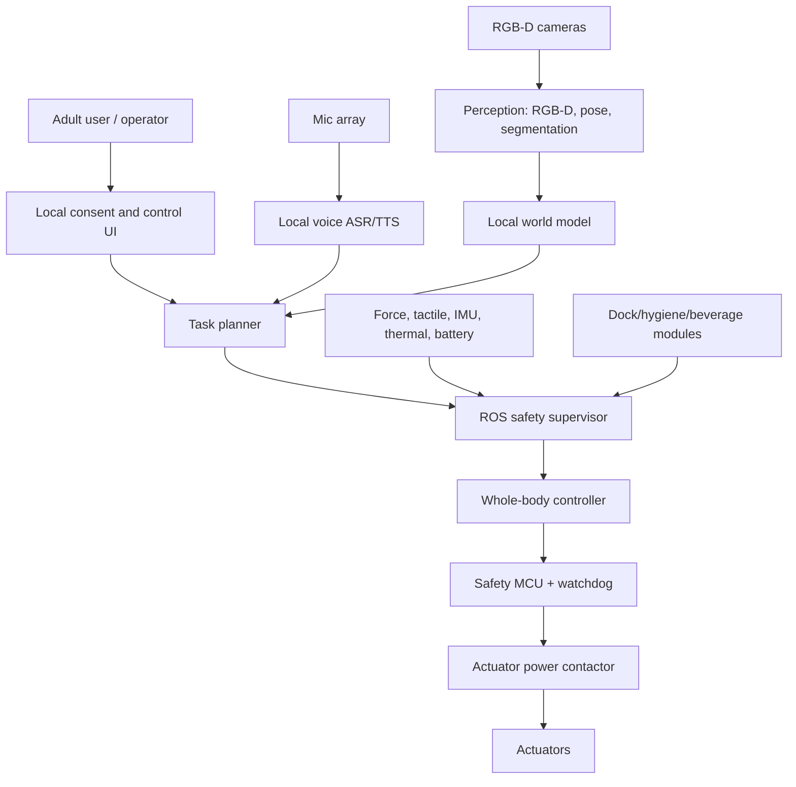

# System architecture

## Compute split

- **Edge AI computer:** perception, local language/voice, policy inference, logs, UI.
- **ROS computer/processes:** transforms, planning, state estimation, controllers.
- **Safety MCU:** e-stop, deadman, watchdog, actuator power, interlocks, power isolation.
- **Motor controllers:** current/torque/speed limits, thermal limits, hardware IDs.

## Data split

- `/sensors/*`: raw observations.
- `/robot/state`: joint state, battery, thermal, safety state.
- `/policy/action_proposal`: AI or teleop action proposal.
- `/safety/approved_action`: hard-gated action forwarded to controllers.
- `/audit/local_event`: local, user-owned event log.
