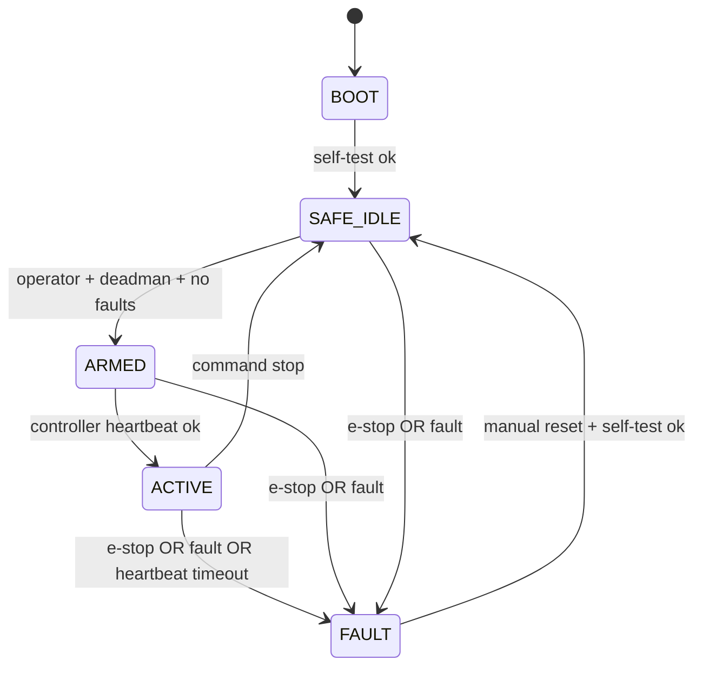

# Safety control loop

The safety MCU must be able to disable actuator power without Linux, ROS, Wi-Fi, cloud, or AI working.

## Safety MCU requirements

- Hardware watchdog.
- Normally-closed e-stop input.
- Normally-closed deadman input.
- Contactor output with feedback.
- Overtemperature input.
- Battery fault input.
- Leak detector input for any fluid module.
- Independent status LED/buzzer.

## Safety state transitions

